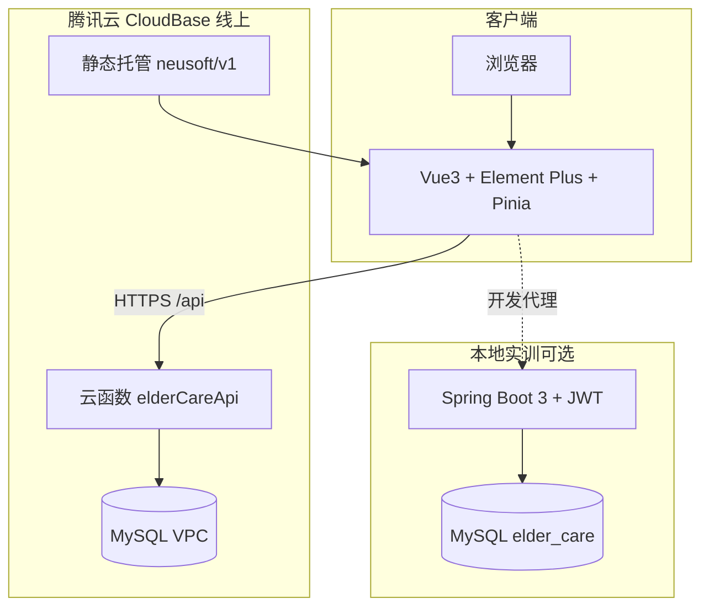
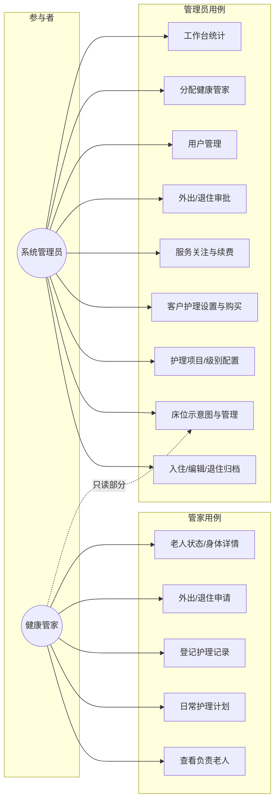
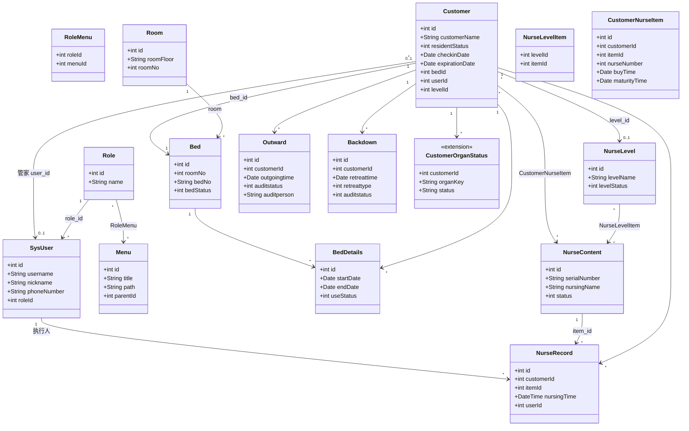
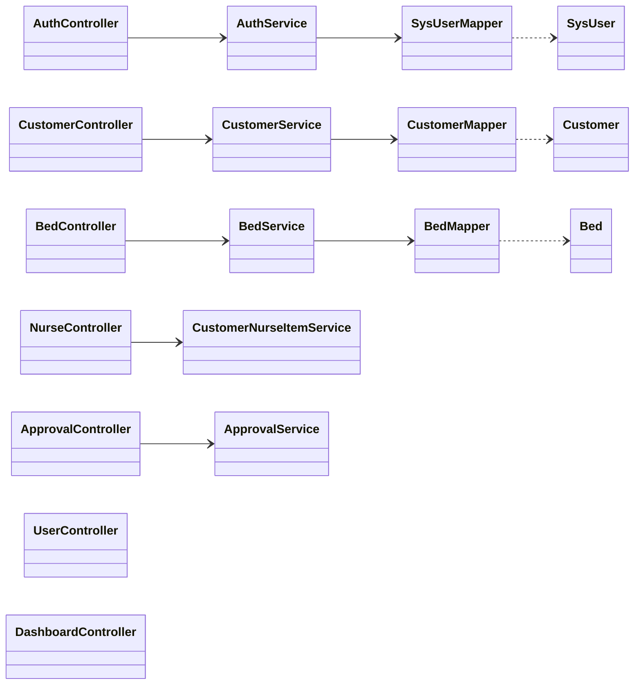
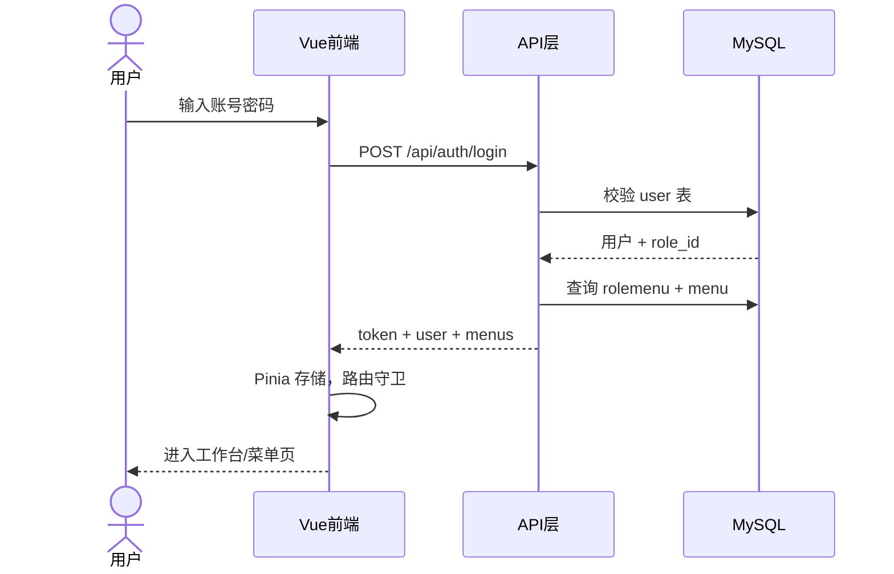
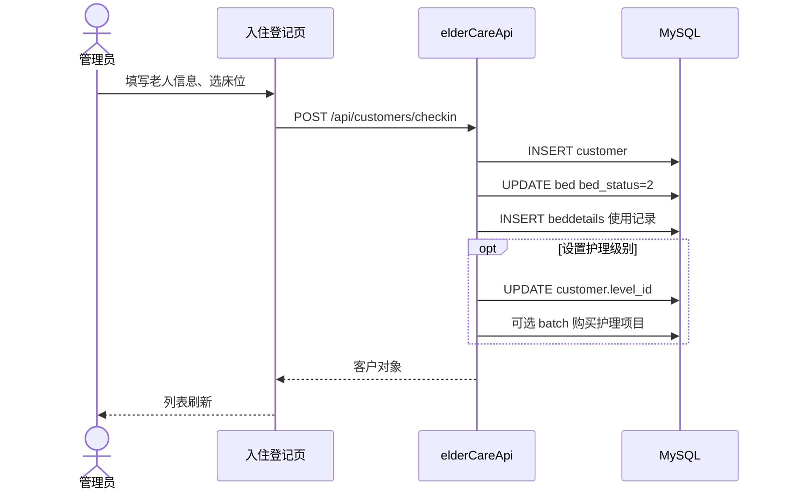
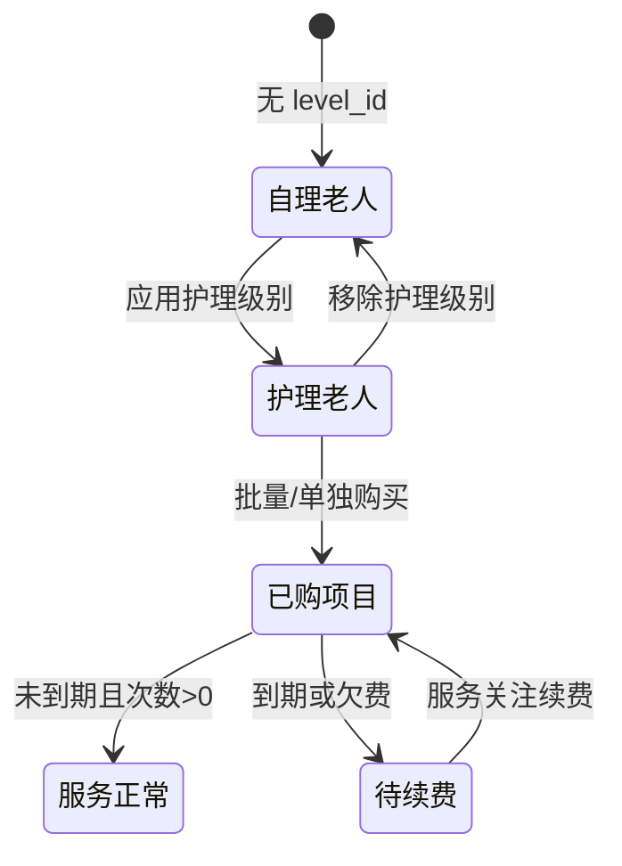

# 东软颐养中心 — UML 设计说明（v1.5.0）

基于当前实现：`frontend/`（Vue3）、`backend/`（Spring Boot）、`cloudfunctions/elderCareApi`（线上 API）、`sql/init.sql`（领域模型）。

---

## 1. 系统部署/组件图（Component Diagram）



---

## 2. 用例图（Use Case Diagram）



---

## 3. 领域类图（Class Diagram — 核心实体）

逻辑关联与数据库表一致；`<<extension>>` 表示线上扩展表。



---

## 4. 后端分层类图（Spring Boot 简化）



线上云函数 `handler.js` 与上述 Controller 职责**同构**（REST 路径 `/api/*`），未单独画包图。

---

## 5. 登录与鉴权时序图（Sequence Diagram）



---

## 6. 入住登记时序图（核心业务）



---

## 7. 护理业务状态（v1.5.0 职责）



---

## 8. 图例与范围说明

| 项目 | 说明 |
|------|------|
| 版本 | 对齐 Git 标签 **v1.5.0** |
| 未实现 UI | `food` / `meal` / `customerpreference` 表在库中存在，无前端页面 |
| 扩展 | `customer_organ_status` 器官状态（3D 身体详情） |
| 角色 | `role_id=1` 管理员；`role_id=2` 健康管家 |

## 9. 报告用彩色类图 PNG（与实训模板同风格）

已生成 **领域类图**（分模块配色、继承、属性与方法）：

| 文件 | 说明 |
|------|------|
| [docs/uml/elder-care-class-diagram.png](uml/elder-care-class-diagram.png) | 可直接插入 Word/PPT |
| [docs/uml/elder-care-class-diagram.puml](uml/elder-care-class-diagram.puml) | PlantUML 源文件，可改后重导 |

重新导出：

```bash
node scripts/render-plantuml.mjs
```

---

导出其他 Mermaid 图：可将下文代码在 [mermaid.live](https://mermaid.live) 中渲染为 PNG。
