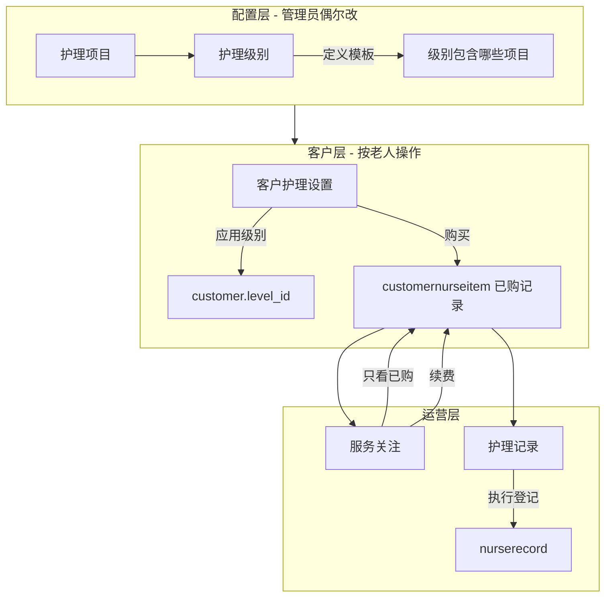

# 护理模块 — 职责划分（避免多处改同一件事）

## 三层结构

## 每个菜单只干一件事

| 页面 | 改什么数据 | 不要在这里做 |
|------|------------|--------------|
| **护理项目** | `nursecontent` 字典（编号、名称、单价） | 不要给老人买东西 |
| **护理级别** | `nurselevel` + `nurselevelitem` 模板 | 不要选老人、不要续费 |
| **客户护理设置** | 老人的 `level_id`；购买/改期/删除 `customernurseitem` | 不要登记今天做了哪次护理 |
| **服务关注** | 仅**续费**已购项目（到期/欠费） | 不再删除/购买（请到客户护理设置） |
| **护理记录** | `nurserecord` 执行记录 | 不要改购买、不要改级别 |
| **日常护理**（管家） | 同上，只登记执行 | 同上 |

## 推荐操作顺序（一位护理老人）

1. **客户护理设置**：选老人 → **应用级别** → **批量购买级别项目**（或单独购买加购项）
2. 管家每日在 **日常护理 / 护理记录** 登记做了哪些项目
3. 合同快到期或次数用完时，在 **服务关注** 筛选「到期/欠费」→ **续费**

## 以前觉得「乱」的原因

1. **服务关注** 与 **客户护理设置** 都能删购买记录 → 已改为服务关注只续费。
2. 一改护理级别下拉就**自动保存并批量购买** → 已改为点 **「应用级别」** 才保存，购买需再点 **「批量购买」**。
3. **护理级别 / 护理项目** 是模板，**客户护理设置** 才是对具体老人生效，界面说明已加强。

## 数据表对应

- `nursecontent` — 项目字典  
- `nurselevel` / `nurselevelitem` — 级别模板  
- `customer.level_id` — 老人当前级别  
- `customernurseitem` — 老人已购（次数、购买日、到期日）  
- `nurserecord` — 实际护理执行记录  
